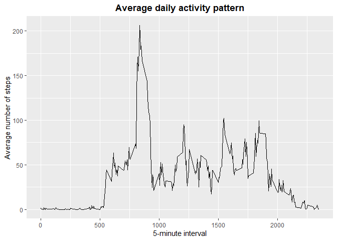
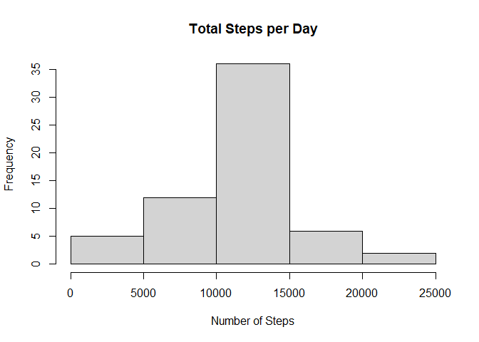
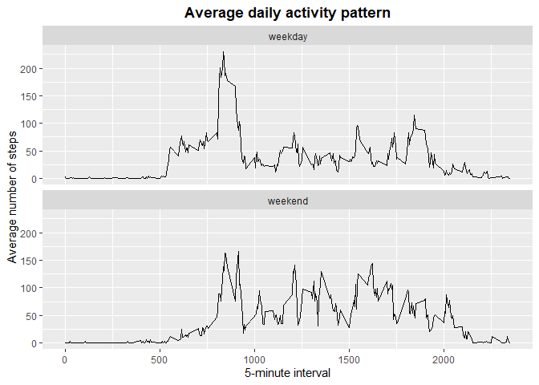

## Loading and preprocessing the data

```r
if(!file.exists('activity.csv')){
        unzip(zipfile= "activity.zip")
}
activity<-read.csv(file="activity.csv",header=TRUE)
```

## What is mean total number of steps taken per day?
1. Total number of steps

```r
StepsT<-aggregate(steps~date,activity,sum, na.rm=TRUE)
```

2. Histogram of the total number of steps taken each day

```r
hist(StepsT$steps, main="Total Steps per Day", xlab="Number of Steps")
```

<!-- -->

3. Mean and median of the total number of steps taken per day

```r
meanSteps<-mean(StepsT$steps,na.rm=TRUE)
medianSteps<-median(StepsT$steps,na.rm=TRUE)
```
The mean is 1.0766189\times 10^{4} steps per day and the median is 10765 steps per day  

## What is the average daily activity pattern?
1. Time series plot of the 5-minute interval (x-axis) and the average number of steps taken, averaged across all days (y-axis)


```r
library (ggplot2)
StepsAv<-aggregate(steps~interval,activity,mean)
g<-ggplot(StepsAv, aes(interval,steps)) ## Setup ggplot with data frame
g+geom_line()+
        ggtitle("Average daily activity pattern")+
        xlab("5-minute interval")+
        ylab("Average number of steps")+
        theme(plot.title = element_text(face = "bold",hjust = 0.5))
```

<!-- -->

2. 5-minute interval with maximum number of steps

```r
IntStepsMax<-StepsAv[which.max(StepsAv$steps),]
```

The interval 835 has the maximun number of steps: 206.1698113  

## Imputing missing values
1. Number of missing values

```r
DataMiss<-sum(is.na(activity$steps))
```

The dataset has 2304 missing values

2. Strategy for filling in missing values  

Missing values will be replaced with the 5-day mean of their interval.

3. New dataset with the missing data filled in

```r
activityN<-transform(activity,steps=ifelse(is.na(activity$steps),StepsAv$steps[match(activity$interval,StepsAv$interval)],activity$steps))
```

4. Histogram of the total number of steps taken each day

```r
StepsN<-aggregate(steps~date,activityN,sum, na.rm=TRUE)
hist(StepsN$steps, main="Total Steps per Day", xlab="Number of Steps")
```

<!-- -->

5. Mean and median of the total number of steps taken per day

```r
meanStepsN<-mean(StepsN$steps,na.rm=TRUE)
medianStepsN<-median(StepsN$steps,na.rm=TRUE)
```

In the new dataset the mean is 1.0766189\times 10^{4} steps per day and the median is 1.0766189\times 10^{4} steps per day. 


```r
meanD<-abs(meanSteps-meanStepsN)
meanD_P<-abs(meanSteps-meanStepsN)*100/meanSteps
medianD<-abs(medianSteps-medianStepsN)
medianD_P<-abs(medianSteps-medianStepsN)*100/medianSteps
```
The absolute difference in the mean is 0 step per day which is a difference of 0%. The absolute difference in the median is 1.1886792 steps per day which is a difference of 0.0110421%. Therefore the impact appears to be minimum.  

## Are there differences in activity patterns between weekdays and weekends?
1. New factor variable with two levels – “weekday” and “weekend"


```r
activityN$dateFormat<-as.Date(activityN$date,format="%Y-%m-%d")
activityN$dayType<-as.factor(ifelse(weekdays(activityN$dateFormat) %in% c("Saturday","Sunday"),"weekend","weekday") )
```

2. Panel plot containing a time series plot of the 5-minute interval (x-axis) and the average number of steps taken, averaged across all weekday days or weekend days (y-axis). 

```r
StepsAv_N<-aggregate(steps~interval+dayType,activityN,mean)
g<-ggplot(StepsAv_N, aes(interval,steps)) ## Setup ggplot with data frame
g+geom_line()+
        facet_wrap(~dayType, nrow = 2, ncol = 1)+
        ggtitle("Average daily activity pattern")+
        xlab("5-minute interval")+
        ylab("Average number of steps")+
        theme(plot.title = element_text(face = "bold",hjust = 0.5))
```

<!-- -->
